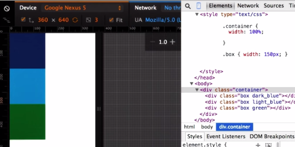
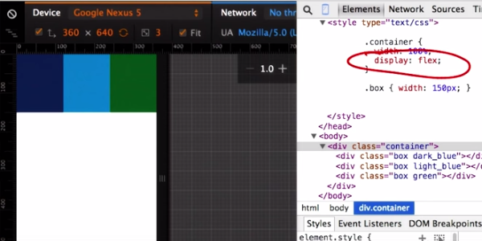
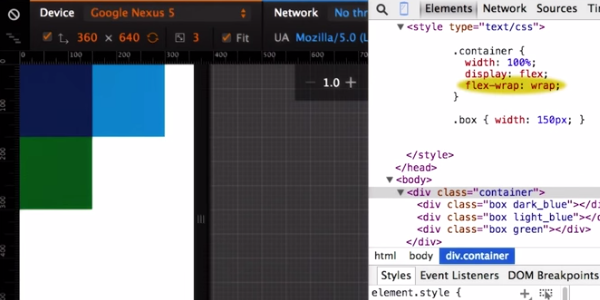
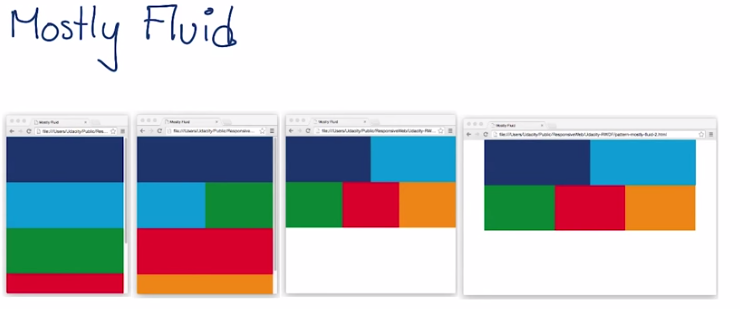
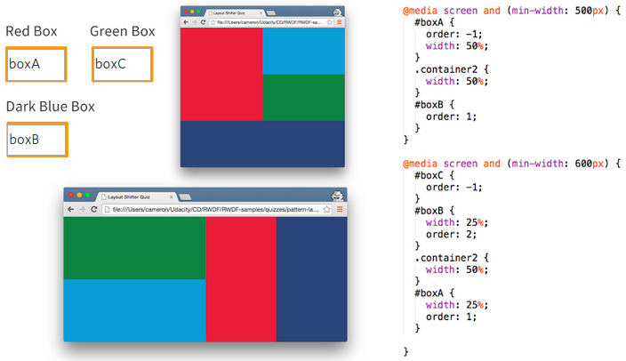

# Responsive Web Design Fundamentals
* [udacity.com](https://www.udacity.com/course/responsive-web-design-fundamentals--ud893)
* [Meu repositório no Github](https://github.com/lekoshimura/responsive-web-design-fundamentals)

## Emulators
* [BrowserStack](http://www.browserstack.com/)
* Chrome Emulator: ctrl + shit + j -> toggle devide mode

## Using dev tools on mobile
* Instalar versão de desenvolvimento do Chrome:
 * [Download and install Chrome Canary](http://www.google.com/intl/en/chrome/browser/canary.html) (it will not interfere with your regular Chrome)
 * [On Linux, the Chromium Dev channel](http://www.chromium.org/getting-involved/dev-channel) is similar to Canary.
 * [iOS WebKit Debug Proxy](https://github.com/google/ios-webkit-debug-proxy)
 * Learn about Remote Debugging on Android with Chrome [link](https://developer.chrome.com/devtools/docs/remote-debugging)

---------------------------------------

## Material:
* [Vídeo (Udacity)](https://www.youtube.com/watch?v=8VzfRyDf8bo)
* Material necessário: telefone Android + Chrome + Cabo Usb
* Acionar modo developer no Android ():
 * Geralmente é assim: Setting -> About -> Clicar 7x sobre "Build Number"
 * Acionar "USB debugging": Setting -> Developer Options -> Allow USB debugging
* No Chrome:
  * chrome://inspect/#devices
* Ligar o Android ao computador com o cabo USB


## Um pixel não é um pixel
* As telas de diferentes dispositivos tem densidades diferentes de pixels.
* DIP:
  * Device Independant Pixels: é a proporção entre pixels de tela e pixels de viewport (CSS)
  * 2560 pixel display / 2 DIP = 1280 viewport width
* [A pixel is not a pixel](https://developer.mozilla.org/en-US/docs/Mozilla/Mobile/Viewport_meta_tag)


## Setting the Viewport
* A typical mobile-optimized site contains something like the following:
  ```html
  <meta name="viewport" content="width=device-width,initial-scale=1">
  ```
 * `meta name="viewport"`: diz para o browser que sabemos o que estamos fazendo e não queremos que ele tente adivinhar o DIP
 * `width=device-width`: incialmente, o conteúdo deve ocupar a largura da tela
 * `initial-scale=1`: fixa do DIP=1
* Usar larguras relativas:
  * `img, embed, object, video {max-width: 100%}`
  * use a definição acima. Sempre.
  * É considerado que 48 pixels de largura e altura é o mínimo que um elemento deve ter para ser clicável em tela pequena.

## Roteiro de otimização par responsividade
* Adicionar `meta name="viewport"`
* Ajustar CSS para que tudo seja exibido em uma coluna. Use larguras relativas (width: nnn%) de maneira que os elementos expandam-se para ocupar a largura total da viewport.
* Certifique que os links de botões sejam fáceis de serem clicados (48px)
* Teste: telefone, tablet, desktop

---------------------------------------------------

## Adding a Media Query
* _só é carregado quando a tela tem largura maior do que 500px_ <br />
```html
<link rel="stylesheet" media="screen and (min-width:500px)" href="500px.css">
```

* _[idem]_<br />
```css
@media screen and (min-width: 500px) {body {background-color: red}}
```

* _@import tem performance ruim. evite._<br />
```css
@import url("no.css") only screen and (min-width:500px)
```

Mais exemplos:
```css
@media screen and (min-width: 0px) and (max-width: 400px) {
  body {background-color: red;}
}
@media screen and (min-width:401px) and (max-width:599px) {
  body {background-color: green;}
}
@media screen and (min-width:600px) {
  body {background-color:blue}
}
```
## Dicas
* Como escolher os breakpoints?
 * É um processo criativo. O método exposto pelo instrutor é de começar com uma ela pequena de redimensioná-la gradativamente. Quando o conteúdo apresentar-se "pedindo" uma mudança, defina um breakpoint.
 * (Picking Breakpoints)[https://www.youtube.com/watch?v=17XgkPFq6eY]
 * ![Breakpoints][breakpoint]
 [breakpoint]: breakpoint.png

 ---------------------------------------------------

## Flexbox






 ---------------------------------------------------

## Patterns: Mostly Fluid
Baseia-se em Flexbox e numa estrutura de grid definida por breakpoints (larguras de tela). Quando a tela atinge a largura máxima desejada, adiciona-se margens.



```css
.container {
  display: flex; flex-wrap: wrap;
}

@media screen and (min-width: 450px){
  .box {
    width: 50%;
  }
}

@media screen and (min-width: 600px){
  .box {
    width: 100%;
  }
}

@media screen and (min-width: 800px) {
  .container {
    width: 800px;
    margin-left: auto;
    margin-right: auto;
  }
}
```

## Patterns: Layout Shifter
Idem a Mostly Fluid com o uso do parâmetro css ```order``` para alterar a posição de elementos a cada breakpoint.



## Patterns: Off-Canvas
É o que tem navigation bar (ou side nav).
```css
.nav {
  width: 300px;
  position: absolute;
  /* This trasform moves the drawer off canvas. */
  -webkit-transform: translate(-300px, 0);
  transform: translate(-300px, 0);
  /* Optionally, we animate the drawer. */
  transition: transform 0.3s ease;
}
.nav.open {
  -webkit-transform: translate(0, 0);
  transform: translate(0, 0);
}

```
```javascript
menu.addEventListener('click', function(e) {
  drawer.classList.toggle('open');
  e.stopPropagation();
});
```
**
nota: e.stopPropagation() previne que o evento "borbulhe" até o nível mais 
alto do DOM. Veja no [MDN](https://developer.mozilla.org/en-US/docs/Web/API/Document_Object_Model/Examples#Example_5:_Event_Propagation)
**

## Tables: técnica Hidden Columns

Oculta-se algumas colunas de acordo com breakpoints.

```html
<table>
  <tr>
    <td class="fica">Nome</td>
    <td class="naofica">Valor 1</td>
    <td class="naofica">Valor 2</td>
    <td class="fica">Total</td>
  </tr>
</table>
```

```css
  @media screen and (max-width:450px) {
    .naofica {
      display:none;
    }
  }
```


